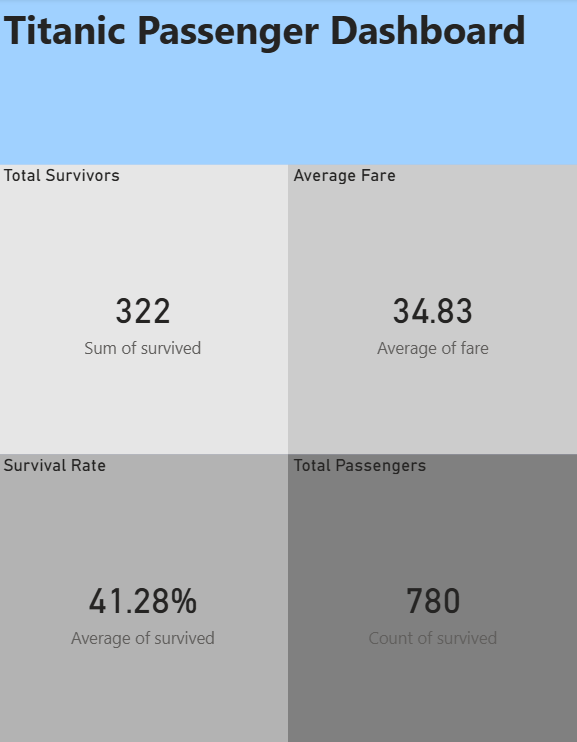
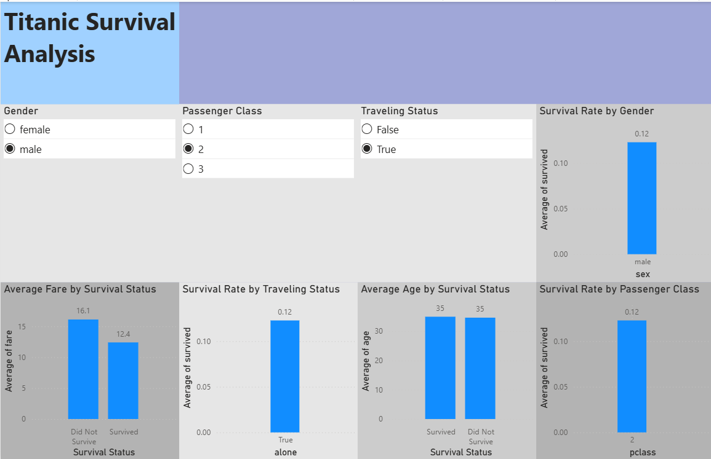

# Titanic Data Analytics Case Study

An end-to-end data analytics project developed as part of my SWYNEX Technologies internship.

This project demonstrates the complete analytics workflow — from raw data inspection and cleaning to exploratory analysis, visualization, interactive dashboard development, and analytical insights.

---

## Project Overview

The Titanic dataset provides information about passengers, including demographic characteristics, passenger class, fare, family relationships, and survival status.

The objective of this project was to transform the raw dataset into a clean, analysis-ready dataset and use data analytics techniques to identify meaningful patterns in passenger survival.

### Key Questions

- How did survival rates differ between male and female passengers?
- How was passenger class associated with survival?
- Did traveling alone affect observed survival rates?
- How did average fare differ between survivors and non-survivors?
- Did average age differ between survivors and non-survivors?
- Are there unusual values that require further investigation?

---

## Analytics Workflow

Raw Dataset
     ↓
Data Inspection
     ↓
Data Cleaning
     ↓
Exploratory Data Analysis
     ↓
Data Visualization
     ↓
Power BI Dashboard
     ↓
Key Insights
     ↓
Final Case Study

---

## Dataset

**Source:** Public Titanic dataset from the Seaborn dataset repository.

### Original Dataset

- **Rows:** 891
- **Columns:** 15

### Cleaned Dataset

- **Rows:** 780
- **Columns:** 14
- **Missing values:** 0
- **Duplicate rows:** 0

The `deck` column was removed because approximately 77% of its values were missing.

---

## Data Cleaning

The raw dataset was inspected using Python and Pandas.

The cleaning process included:

- Identifying missing values
- Detecting duplicate records
- Checking data types
- Checking categorical consistency
- Filling missing age values using the median
- Filling missing categorical values using the mode
- Removing the highly incomplete `deck` column
- Performing a final duplicate check
- Exporting the cleaned dataset

### Result

**891 original rows → 780 cleaned rows**

The complete cleaning methodology is documented in the [Final Case Study](docs/final_case_study.md).

---

## Exploratory Data Analysis

Exploratory analysis was performed using:

- Python
- Pandas
- Matplotlib

### Key Findings

| Analysis | Result |
|---|---:|
| Overall Survival Rate | 41.28% |
| Female Survival Rate | 73.97% |
| Male Survival Rate | 21.72% |
| 1st Class Survival Rate | 63.68% |
| 2nd Class Survival Rate | 50.61% |
| 3rd Class Survival Rate | 25.74% |
| Traveling With Someone | 51.18% |
| Traveling Alone | 33.71% |
| Average Fare — Survivors | 50.19 |
| Average Fare — Non-Survivors | 24.03 |

### Main Insights

- Gender showed one of the strongest differences in observed survival rates.
- Survival rates decreased substantially from 1st class to 3rd class.
- Passengers traveling with someone had a higher observed survival rate than passengers traveling alone.
- Survivors paid a higher average fare than non-survivors.
- The average age difference between survivors and non-survivors was relatively small.
- Extremely high fare values were retained as potential outliers because they may represent legitimate premium fares.

---

## Exploratory Analysis Charts

### Survival Rate by Gender

### Survival Rate by Passenger Class

### Average Age by Survival Status

### Average Fare by Survival Status

### Survival Rate by Traveling Status

---

## Interactive Power BI Dashboard

An interactive Power BI dashboard was created to communicate the major findings.

### Dashboard Pages

#### Page 1 — Titanic Passenger Dashboard

Includes:

- **Total Passengers:** 780
- **Total Survivors:** 322
- **Survival Rate:** 41.28%
- **Average Fare:** 34.83

#### Page 2 — Titanic Survival Analysis

Includes:

- Survival Rate by Gender
- Survival Rate by Passenger Class
- Survival Rate by Traveling Status
- Average Fare by Survival Status
- Average Age by Survival Status

### Interactive Filters

- Gender
- Passenger Class
- Traveling Status

### Dashboard Preview

#### Dashboard Overview

#### Survival Analysis

### Power BI Dashboard File

[Open the Power BI Dashboard](dashboard/SWYNEX_Titanic_Interactive_Dashboard.pbix)

---

## Project Structure

SWYNEX-Titanic-Data-Analytics-Case-Study/
│
├── data/
│   ├── titanic.csv
│   └── cleaned_titanic.csv
│
├── scripts/
│   ├── inspect_data.py
│   ├── clean_data.py
│   └── exploratory_analysis.py
│
├── charts/
│   ├── survival_by_gender.png
│   ├── survival_by_class.png
│   ├── average_age_by_survival.png
│   ├── average_fare_by_survival.png
│   └── survival_by_traveling_status.png
│
├── dashboard/
│   ├── SWYNEX_Titanic_Interactive_Dashboard.pbix
│   ├── dashboard_overview.png
│   └── survival_analysis.png
│
├── docs/
│   └── final_case_study.md
│
└── README.md

---

## Technologies Used

- Python
- Pandas
- Matplotlib
- Microsoft Power BI
- GitHub
- Markdown

---

## Skills Demonstrated

- Data Cleaning
- Data Preparation
- Exploratory Data Analysis
- Statistical Analysis
- Data Visualization
- Dashboard Development
- Interactive Filtering
- Data Storytelling
- Analytical Documentation
- GitHub Project Organization

---

## Limitations

The analysis identifies associations within the Titanic dataset and does not establish causal relationships.

Additionally, duplicate removal was based on complete-row comparison because the selected dataset does not contain a unique passenger identifier.

Missing age values were replaced using the median, which allows analysis to continue but does not recover the passengers' actual ages.

---

## Detailed Case Study

For the complete methodology, analysis, limitations, workflow, and conclusion:

[Read the Full Case Study](docs/final_case_study.md)

---

## Project Status

**Completed**

This project represents a complete end-to-end data analytics case study developed during my SWYNEX Technologies internship.
